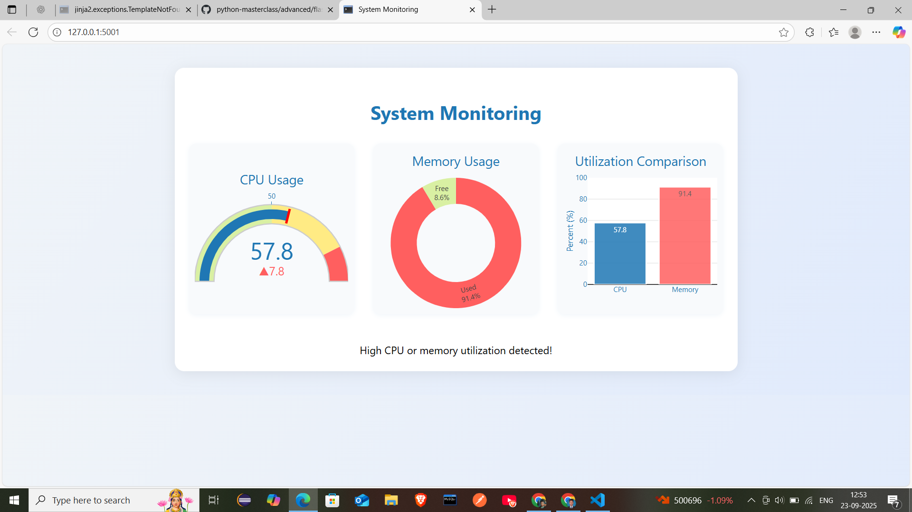

# Python-InfraMonitor
This project is a real-time system monitoring dashboard built with Python, Flask, and Plotly, designed to showcase automation and DevOps scripting skills. It visualizes CPU and memory usage with interactive charts, auto-refreshes every 5 seconds, and provides alerts for high resource utilization. The dashboard features a modern, responsive dark theme and demonstrates how Python scripting can be used for infrastructure monitoring and DevOps workflows. Ideal for technical interviews and DevOps demonstrations.

Python infraMonitor

